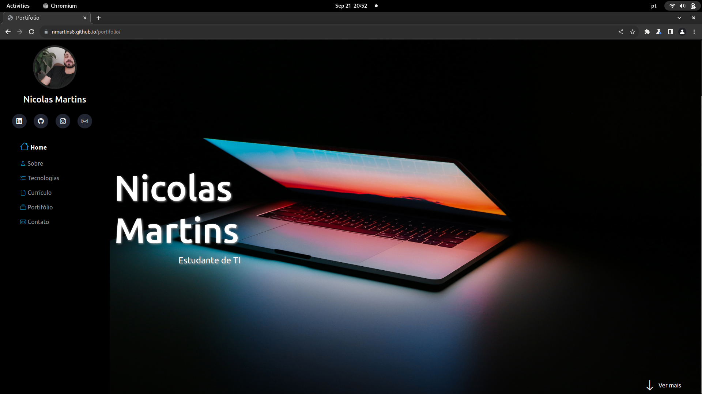
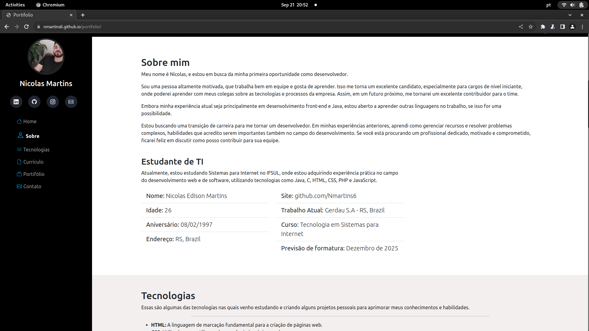

# Meu Portfólio

Este é o repositório do meu portfólio pessoal, onde mostro um pouco do que venho aprendendo, projetos e informações sobre mim. Este portfólio foi desenvolvido com HTML, CSS, JavaScript e Bootstrap.





## Visão Geral

Este projeto é uma representação online do que tenho estudado em frontend, habilidades e experiência. Ele inclui:

- Uma página com uma breve introdução sobre mim.
- Uma seção de projetos destacando alguns projetos em que tenho me envolvido.
- Uma seção de contato com informações de contato e links para minhas redes sociais.

## Tecnologias Utilizadas

- HTML5
- CSS3
- JavaScript
- Bootstrap

## Como Usar

1. Simplismente acessando na internet:

- Este projeto está hospedado no GitHub Pages. Você pode visualizá-lo online [aqui](https://nmartins6.github.io/portifolio/).


## Contribuição
Existem várias maneiras de contribuir com este projeto:

1. Interagindo no GitHub: Você pode abrir [issues](https://github.com/Nmartins6/portifolio/issues), fazer solicitações de [pull](https://github.com/Nmartins6/portifolio/pulls) ou sugerir melhorias diretamente no GitHub.

2. Contato via LinkedIn: Você pode me contatar via [LinkedIn](https://www.linkedin.com/in/nicolasedm/) para discussões ou colaborações.

3. Formulário de Contato: Utilize o [Formulário de Contato](https://docs.google.com/forms/d/e/1FAIpQLSfqC2GmJpQhmM_AdgEKpVY-lmJkQXWww9s9axQQTJdcr5BVkQ/viewform) na página de contato para enviar feedback ou perguntas.

4. Criando sua Própria Versão: Sinta-se à vontade para clonar este repositório, criar sua própria versão do portfólio, e compartilhar comigo!

```shell
   git clone https://github.com/Nmartins6/portifolio.git
```

## Notas: 

- Preciso resolver alguns problemas de principalmente relacionados a responsividade, na página.
- Avaliar a melhor maneira de internacionalizar esta página.


